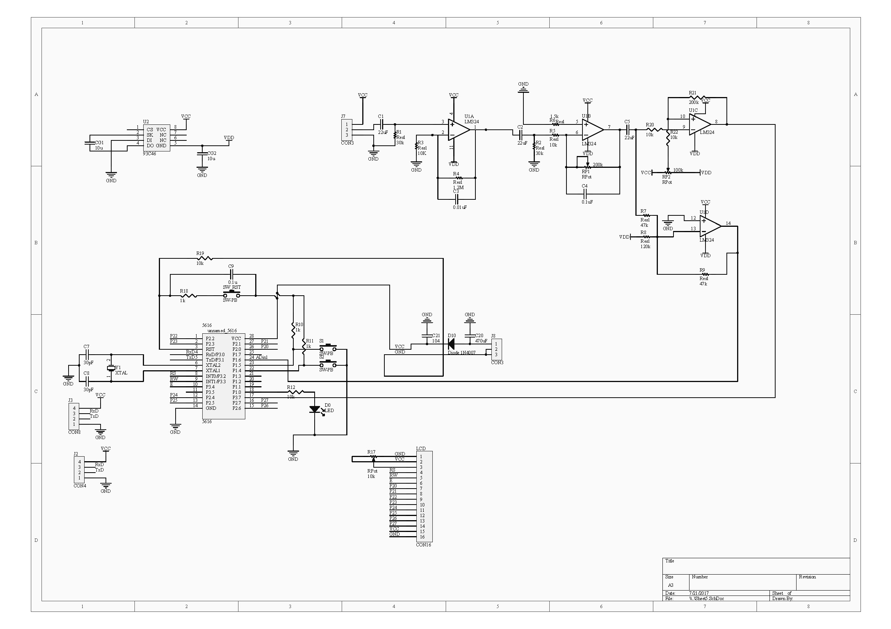
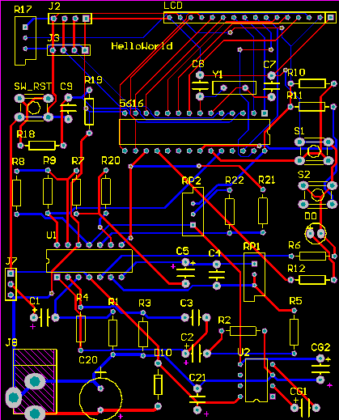
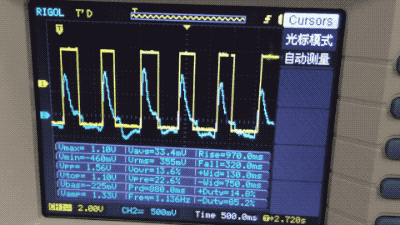
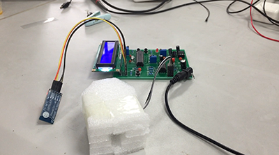
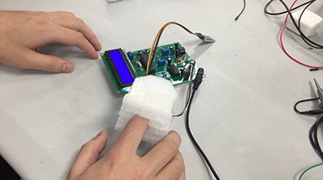
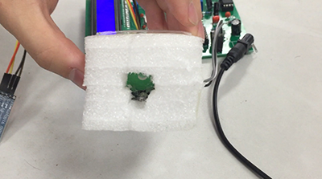

# Pulsometer

- Author: LIN JIANING
- Date: 2017.7
- Course: Electronic Circuit
- Hardware: STC51 MCU, Self-designed Circuit
- Lanuage: C
- IDE: Keil5
- Description: We made a simple pulsometer using MCU and self-designed circuit. This tool can detect heartbeats and may find some heart disease by calculating the cycle of heartbeats.

- Schematic & PCB:

- Presentation

|                |  |
| --------------------------------- | --------------------------------- |
|  |  |

